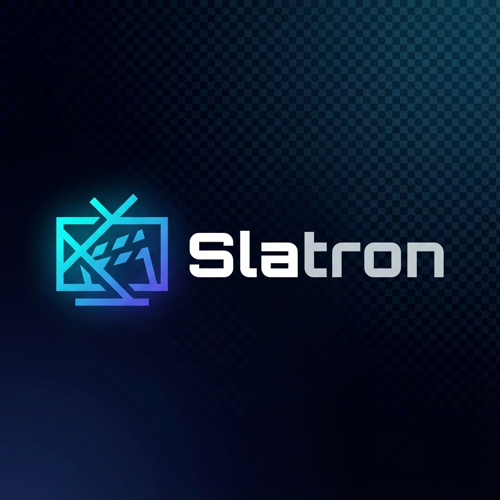

<div align="center">
  
  <h1>Slatron</h1>
  <p>
    <strong>The intelligent TV station manager with adaptive AI hosts and distributed playback for DIY hackable TV stations, radio, and digital signage.</strong>
  </p>
  <p>
    <a href="https://github.com/JustinWoodring/slatron/actions/workflows/nightly.yml">
      
    </a>
  </p>
</div>

Slatron allows you to manage content, schedule broadcasts, and control playback nodes across your network from a centralized, web-based dashboard. It features **fully autonomous AI DJs** that can introduce tracks, read news, and manage the vibe of your station.

---

## 🌟 Key Features

*   **Adaptive AI DJs**: Create diverse AI personalities to host your station, with support for Google Gemini, Anthropic Claude, OpenAI, Ollama, and local LLMs (Orpheus).
*   **Dynamic Bumpers & Station Branding**: Create professional station idents, transitions, and lower thirds using MLT templates with variable substitution. Upload custom bumper backgrounds or use built-in animated gradients.
*   **Centralized Management**: Manage multiple playback nodes (TVs, screens) from a single server.
*   **Flexible Scheduling**: Drag-and-drop schedule grid with layered priorities and interrupt scheduling.
*   **Role-Based Access Control (RBAC)**: Secure your station with `Admin`, `Editor`, and `Viewer` roles.
*   **Real-time Monitoring**: Live status updates and screenshots from nodes.
*   **Scripting Engine**: Use Rhai scripts for dynamic content loading, overlays, playback logic, and automated bumper injection.
*   **Resilient Playback**: Local caching on nodes ensures playback continues even if the network goes down.
*   **Content Library**: Organize video files and manage valid paths per node with YouTube playlist support.

---

## 🚀 Quick Start

### VIDEO TUTORIALS:
- [Getting Started with Slatron on Mac](https://youtu.be/alMnX4MNhcI)


## Building For Yourself

### 0. Build Prerequisites

#### Required
*   **Rust** (1.75+)
*   **Node.js** (18+) - For building the UI
*   **SQLite** - For the server database

#### Required on Playback Nodes
*   **MPV** - Media player with IPC support
*   **yt-dlp** - For YouTube content support (MPV integration)

#### Required on Server (for Bumpers)
*   **MLT Framework** (`melt` command) - For rendering bumper templates
*   **FFmpeg** (`ffprobe` command) - For extracting video duration

#### Optional
*   **libort** - Required only if building server with `ml-support` feature for local Orpheus TTS
*   **curl** - For downloading remote bumper backs (usually pre-installed)

### 1. Setting up the Server (`slatron-server`)

The server manages the database, API, and serving the web interface. It will automatically initialize the database and run migrations on startup.

```bash
cd slatron-server

# 1. Setup Database Directory
mkdir -p data

# 2. Build & Run (Embedding the UI for ease of use)
# This requires `npm` to be in your path, as it builds the UI automatically.
cargo run --release --features embed-ui -- --generate-config > config.toml
# Edit config.toml if needed, then:
cargo run --release --features embed-ui
```

The server will start on `http://0.0.0.0:8080` (or your configured port).
**Default Login**: `admin` / `admin`

### 2. Setting up a Node (`slatron-node`)

The node runs on the computer connected to the display (e.g., a Raspberry Pi or mini PC).

```bash
cd slatron-node

# 1. Generate a config template
cargo run --release -- --generate-config > config.toml

# 2. Edit config.toml
# - Set `server_url` to your server's WebSocket URL (e.g., ws://192.168.1.10:8080/ws)
# - You will need a `secret_key`. Log into the Web UI, go to "Nodes", create a node, and copy its secret.

# 3. Run the node
cargo run --release
```

**Note**: Ensure `mpv` and `yt-dlp` are installed and available in the system PATH. Slatron will launch and control MPV automatically.

**Installing Node Dependencies (macOS):**
```bash
brew install mpv yt-dlp
```

**Installing Node Dependencies (Linux/Debian):**
```bash
sudo apt install mpv yt-dlp
```

**Installing Server Dependencies (macOS):**
```bash
brew install mlt ffmpeg
```

**Installing Server Dependencies (Linux/Debian):**
```bash
sudo apt install ffmpeg mlt
```

---

## ⚙️ Configuration

Both components support CLI arguments for configuration management.

### Command Line Interface
- **Generate Template**: `slatron-server --generate-config` (Prints to stdout)
- **Specify File**: `slatron-server --config my_config.toml`
- **Default / Interactive**: Looks for `config.toml` in the current directory. If not found and running in an interactive terminal, it will launch an **Onboarding Wizard** to help you generate one.

### Server Configuration (`server-config.toml`)

```toml
[server]
host = "0.0.0.0"
port = 8080
# Optional: Path to serve UI files from. 
# If omitted and compiled with `embed-ui`, it uses the internal zip.
# ui_path = "./static"

[server.https]
enabled = false
# cert_path = "/path/to/cert.pem"
# key_path = "/path/to/key.pem"

[database]
url = "sqlite://data/slatron.db"

[jwt]
secret = "CHANGE_THIS_IN_PRODUCTION"
expiration_hours = 24
```

### Node Configuration (`node-config.toml`)
```toml
node_name = "Lobby Display"
server_url = "ws://localhost:8080/ws"
secret_key = "PASTE_SECRET_FROM_UI"
heartbeat_interval_secs = 5
mpv_socket_path = "/tmp/mpv-socket"
```

---

## 🎙️ AI DJs & Orpheus

Slatron features a dynamic **AI DJ** system that can "speak" between songs, introducing tracks, reading news, or just creating a vibe.

### LLM Providers
You can configure different LLM providers for DJ personality:
*   **Google Gemini**: High-quality cloud-based models
*   **Anthropic Claude**: Claude 3.5 Sonnet and other Claude models
*   **OpenAI**: GPT-4 and other OpenAI models
*   **Ollama**: Local LLM server for privacy and cost savings

### Voice Providers
You can configure different voice providers for DJ speech synthesis:
*   **Gemini TTS**: High-quality cloud-based TTS from Google
*   **Orpheus (Local)**: Fully offline, local text-to-speech engine powered by specific LLM checkpoints

### Setting up Orpheus (Local TTS)
"Orpheus" allows you to run a high-quality DJ voice entirely on your own hardware (no API costs).

1.  **Install LM Studio**: Download and install [LM Studio](https://lmstudio.ai/).
2.  **Download Model**: Search for and download the `isaiahbjork/orpheus-3b-0.1-ft` model.
3.  **Start Local Server**:
    *   Load the model in LM Studio.
    *   Go to the "Local Server" tab.
    *   Start the server on port `1234` (default).
4.  **Configure Slatron**:
    *   In the Slatron Dashboard, go to **Settings > AI Providers**.
    *   Add a new provider with type **Orpheus**.
    *   Set the Endpoint URL to: `http://127.0.0.1:1234/v1/completions`.
    *   **Important**: You must compile the server with the `ml-support` feature enabled (`cargo run --features ml-support`) as Slatron handles the audio decoding (SNAC) locally. The server when compiled with this option embeds the rather sizeable model, but obviously for space concerns it can be compiled with local orpheus support for said reason.

### Data & Configuration

#### Voice Name
The `Voice Name` field in the DJ Profile maps differently depending on the provider:
*   **Gemini TTS**: Use standard model names (e.g., `Aoede`, `Charon`, `Fenrir`, `Puck`, `Zephyr`).
*   **Orpheus**: Use the specific character name supported by the model (e.g., `tara` for the default fine-tune).

#### Context Injector Scripts
DJs can be made "aware" of their environment using **Context Scripts**. These are server-side Rhai scripts that run *before* the prompt is sent to the LLM.

*   **Logic**: The script can fetch data (weather, stock prices, internal server state) and must return a **String**.
*   **Injection**: The returned string is appended to the "Context" block in the system prompt.
*   **Example Script**:
    ```rust
    // Get weather for station location
    let weather = http_get("generic.weatherapi.com/NY");
    context += "Current weather in NY is " + weather + ". Mention it if relevant.";
    ```

#### Content Loader Scripts
You can also use Rhai scripts to **bulk import content** (e.g., from YouTube playlists or RSS feeds).
*   **Location**: "Configuration > Scripts". Create a script of type `Content Loader`.
*   **Usage**: In "Content > Add Content", switch to "Import via Script".
*   **Return Format**: The script must return a JSON Object (for one item) or a JSON List (for bulk import).
    ```json
    [
      { "title": "Video 1", "url": "https://...", "duration_minutes": 5 },
      { "title": "Video 2", "url": "https://...", "duration_minutes": 10 }
    ]
    ```

---

## 🎨 Bumpers & Station Branding

Slatron includes a powerful bumper system for creating professional station branding elements like idents, transitions, and lower thirds.

### Bumper Architecture

The bumper system uses a two-layer approach:

1. **Bumper Backs**: Base video files that provide background animation or graphics
   - Can be simple MLT-generated backgrounds (solid colors, gradients)
   - Or user-uploaded video files (.mp4, .mov, .webm)
   - Or downloaded from remote URLs

2. **Bumper Templates**: MLT templates that overlay station branding on top of bumper backs
   - Support variable substitution: `{{STATION_NAME}}`, `{{THEME_COLOR}}`, `{{BUMPER_BACK_PATH}}`
   - Rendered to final MP4 videos using the MLT Framework

### Default Bumpers

Slatron ships with:
- **3 Simple Bumper Backs**: Solid Blue, Solid Purple, Solid Grey (MLT-generated)
- **1 Station Ident Template**: Displays station name with theme color outline over bumper back

### Creating Custom Bumpers

1. **Upload a Bumper Back Video** (optional):
   - Navigate to Bumpers → Bumper Backs in the UI
   - Upload your animated background video or download from URL

2. **Create a Bumper Template**:
   - Go to Bumpers → Create New Bumper
   - Write an MLT XML template using variable substitution
   - Link to a bumper back for the background layer
   - Click "Render" to generate the final video

3. **Automated Injection**:
   - Use the built-in "Auto Station Bumpers" global script
   - Or write custom Rhai scripts using `inject_bumper("Bumper Name")`

### Example: Custom Station Ident MLT Template

```xml
<?xml version="1.0"?>
<mlt LC_NUMERIC="C" version="7.0.0">
  <profile description="HD 1080p 30 fps" width="1920" height="1080"
          progressive="1" frame_rate_num="30" frame_rate_den="1"/>

  <!-- Bumper back as background -->
  <producer id="back" mlt_service="avformat">
    <property name="resource">{{BUMPER_BACK_PATH}}</property>
  </producer>

  <!-- Station name overlay -->
  <producer id="text" mlt_service="pango">
    <property name="family">Montserrat</property>
    <property name="size">150</property>
    <property name="markup">{{STATION_NAME}}</property>
    <property name="fgcolour">#ffffff</property>
    <property name="outline">3</property>
    <property name="olcolour">{{THEME_COLOR}}</property>
  </producer>

  <!-- Composite layers -->
  <tractor id="tractor0" in="0" out="149">
    <track producer="back"/>
    <track producer="text"/>
    <transition mlt_service="composite">
      <property name="a_track">0</property>
      <property name="b_track">1</property>
      <property name="geometry">0/0:100%x100%:100</property>
    </transition>
  </tractor>
</mlt>
```

### Rhai Functions for Bumpers

```rhai
// Queue a bumper for playback
inject_bumper("Station Ident");

// Check if it's the top of the hour (:00)
if is_top_of_hour() {
    inject_bumper("Station Ident");
}

// Get current hour (0-23)
let hour = get_current_hour();
if hour >= 6 && hour < 22 {
    inject_bumper("Daytime Transition");
}
```

---

## 📦 Deployment & Frontend Embedding

### Single Binary Deployment
To simplify deployment, you can embed the frontend files directly into the server binary.

1.  Enable the `embed-ui` feature during compilation:
    ```bash
    cargo build --release --bin slatron-server --features embed-ui
    ```
    *This triggers a build script that runs `npm run build` in `slatron-ui` and zips the result.*

2.  Run the binary anywhere. It will automatically extract the UI to an `embedded_ui` directory at startup and serve it.
    *   No need to copy a `static/` folder manually!

### HTTPS Support
Secure your server by enabling HTTPS in `config.toml`. You will need a certificate and private key (e.g., from Let's Encrypt).

---

## 🛠 Architecture

### Components
*   **slatron-server** (Rust/Axum): The brain. Handles database, API, Auth, and WebSockets.
*   **slatron-node** (Rust): The player. Connects to server, downloads content/schedules, and controls MPV via IPC.
*   **slatron-ui** (React/Vite): The face. communicating via REST API.

### Scripting (Rhai)
Slatron uses the Rhai scripting language for safety and flexibility.
*   **Content Loaders**: Custom logic to fetch/prepare content (e.g., download from YouTube).
*   **Global Scripts**: Run logic based on playback events (e.g., "If content < 10s, loop it").

### Heartbeat Monitoring
Nodes send heartbeats every 5 seconds. If the server doesn't hear from a node for **30 seconds**, it automatically marks it as `Offline` in the dashboard.

---

## Scripting API Reference (Rhai)

Scripts in Slatron allow you to customize playback behavior and interactivity.

### Lifecycle Hooks
These functions are called automatically by the node during the playback lifecycle.

*   `fn transform(settings)` -> `Map`
    *   **When**: Called *before* playback starts.
    *   **Purpose**: Update settings (volume, loop, start/end time) based on custom logic.
    *   **Returns**: A Map of settings to override.
*   `fn on_load(settings)`
    *   **When**: Called immediately *after* playback starts.
    *   **Purpose**: Apply overlays, start auxiliary processes, or log events.
*   `fn on_unload(settings)`
    *   **When**: Called *before* the content changes or stops.
    *   **Purpose**: Cleanup (e.g., remove overlays).

### Core Functions

#### Playback Control
*   `set_volume(ctx, volume: int)`: Set playback volume (0-100).
*   `set_loop(ctx, enabled: bool)`: Enable/Disable looping.
*   `set_start_time(ctx, seconds: float)`: Start playback from offset.
*   `set_end_time(ctx, seconds: float)`: Stop playback at offset.
*   `mpv_send(command_map)`: Send a raw JSON command to MPV (Node-side only).

#### System & Content
*   `download_file(url, output_path)`: Downloads a file. Supports `~` expansion on nodes.
*   `shell_execute(command)`: Executes a shell command and returns output.
*   `get_env(key)`: Returns value of an environment variable.

#### Overlays
*   `mpv_overlay(path, x, y, opacity)`: Display an image overlay.
*   `mpv_text(text, x, y, size, color)`: Display text overlay.
*   `mpv_remove_overlay(id)`: Remove an overlay.
*   `get_video_width()` / `get_video_height()`: Get resolution of current content.

#### Station Automation (Bumpers)
*   `inject_bumper(name_or_id)`: Queues a bumper to be played immediately after the current item finishes.
*   `is_top_of_hour()`: Returns `true` if the current time is within the first few minutes of the hour (useful for scheduling idents).
*   `get_current_hour()`: Returns the current hour (0-23) in the station's timezone.

---

## 📄 License

Slatron is licensed under the **GNU Affero General Public License v3.0 (AGPLv3)**.
See the [LICENSE](LICENSE) file for details.

---

**Created by Justin Woodring & SLATRON AUTHORS**
